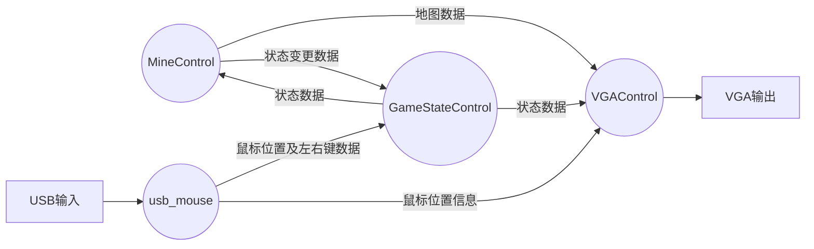
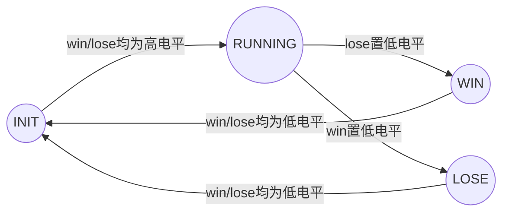
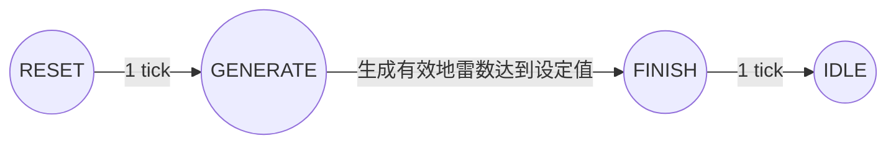

# 数字电路实验报告
## Lab 10 FPGA实验设计
## 实验设计目标
本次实验采用Verilog作为硬件编程语言，利用Nexys4 DDR开发版进行相关实验设计。本次实验设计目标为利用Nexys4开发版实现模仿 Windows XP 上自带小游戏扫雷，实现对地雷地图的随机生成，对已经被打开的格子进行周围地雷数的标记，对周围9格均不是地雷的已开格子进行自动拓展开启，对扫雷输赢的判断。本次实验设计采用开发版自带的VGA接口作为输出，利用USB鼠标进行数据输入。

## 实验设计实现
### 顶层设计模块
顶层设计模块用于将各个子模块连接并将输出信号传入output端口。


### GameStateControl 游戏运行状态控制模块
接口定义

| 端口 | 类型 | 说明 |
| --- | --- | --- |
| clk | input | 时钟信号 |
| rst | input | 主复位信号 |
| win, lose | input | 状态转换数据线 |
| state | output [1:0] | 游戏运行状态 |

本游戏共定义以下四个状态：

| 状态标记 | 状态数值 | 状态描述 |
| --- | --- | --- |
| INIT | 0 | 游戏初始化状态 此状态代表MineControl模块正在对地图进行初始化以及随机生成处理 |
| RUNNING | 1 | 游戏正常运行状态 此状态下MineControl正常接收usb_mouse模块传递的数据并根据数据对地图进行相应改变 |
| WIN | 2 | 游戏结束状态 显示本局结果并等待鼠标按下重置按钮 |
| LOSE | 3 | 游戏结束状态 显示本局结果并等待鼠标按下重置按钮 |

状态机的转换由win与lose高低电平控制：

本设计的状态转换信号能保证信息不会因为时序问题导致状态混乱，故游戏总状态变化较为稳定。

### MineControl 扫雷地图控制模块
##### 接口定义

| 端口 | 类型 | 说明 |
| --- | --- | --- |
| clk | input | 时钟信号 |
| rst | input | 主复位信号 |
| state | input [1:0] | 游戏运行状态 |
| mouseXPos | Input [9:0] | 鼠标指针X坐标 |
| mouseYPos | input [9:0] | 鼠标指针Y坐标  |
| mouseLClick | input | 鼠标左键按下信号 |
| mouseRClick | input | 鼠标右键按下信号 |
| win,lose | output | 状态变换 |
| mine | output [99:0] | 地雷地图 |
| opened | output [99:0] | 已探索格子地图 |
| flaged | output [99:0] | 已标记格子地图 |

##### 内部关键信号
当前鼠标指向格位置。 blockSel的值始终为当前鼠标指向的格子在地图数组中的位置。
```Verilog
assign blockSel = (mouseYPos[8:5] - y_offset) * 10 + (mouseXPos[8:5] - x_offset);
```

##### 模块运行逻辑
**RUNNING**
每个时钟上升边沿，对地图状态进行检测。若地雷地图与开启格子的地图的按位异或值全为1则说明所有非地雷格子均已经找到且有地雷的格子均未被开启，判定为胜利，将lose数据线电平置低。若有地雷地图与开启格子地图按位与结果非0说明有地雷的格子被开启了，判定为失败，将win数据线置低电平。
```Verilog
if(&(mine ^ opened)) begin
    lose <= 1'b0;
end
else if(mine & opened) begin
    win <= 1'b0;
end
```
对鼠标左键点击事件进行判断，若左键按下且鼠标坐标处于重新开始游戏图标内则发送信号将游戏状态切换至结束并立即进行重置。
```Verilog
else if(mouseLClick && (mouseXPos >= (x_offset + 12) * 32 && mouseXPos < (x_offset + 13) * 32 && mouseYPos >= (y_offset + 4) * 32 && mouseYPos < (y_offset + 4) * 32 + 32)) begin
                        lose <= 0;
                        resetDirect <= 1;
                        initState <= RESET;
                    end
```
若左键按下且鼠标坐标处于游戏框内，则对鼠标指向的格子进行状态判断。若格子未被标记且未被打开则将其设置为打开状态。
```Verilog
else if(mouseLClick) begin
    if(!flaged[blockSel] && !opened[blockSel]) begin
        opened[blockSel] <= 1'b1;
        if(mine[blockSel]) begin
            win <= 1'b0;
        end
    end
end
```
若右键按下且鼠标位于游戏框内则对鼠标指向格子进行状态判断。若格子未被打开则将其标记状态取反。
```Verilog
else if(mouseRClick) begin
    if(!opened[blockSel]) begin
        flaged[blockSel] <= ~flaged[blockSel];
    end
end
```
没有鼠标按下的事件的时候，对地图进行遍历，若发现符合格子已被打开且周围8格均不是地雷的格子，则将其周围8格全部标识为已打开。此处仅列出一种情况。
```Verilog
else if(!mine[verifySel] && opened[verifySel]) begin
    if(!counterLU && verifySel == 0) begin
       opened[1] <= 1;
       opened[10] <= 1;
       opened[11] <=1;
       flaged[1] <= 0;
       flaged[10] <= 0;
       flaged[11] <=0;
    end
    // Other cases...
end    
```

**INIT**
游戏处于重置状态下时，将不对输入信号进行处理，同时MineControl内部有一重置状态机将进行工作，分别对应重置的4个状态。

RESET状态仅持续一个时钟周期，该周期内将地图数据mine、opened、flaged均全部置为0.
GENERATE状态将利用Random模块提供的随机数进行地图随机生成。遇到重复的格子将会自动跳过以保证总地雷数相等。
FINISH状态下将win/lose两信息线拉到高电平，通知游戏总状态机切换至RUNNING状态。
IDLE状态下无任何操作。

**WIN/LOSE**
等待鼠标按下游戏重置图标。
```Verilog
if(resetDirect) begin
    win <= 0;
    lose <= 0;
    initState <= RESET;
end
else if(mouseLClick && (mouseXPos >= (x_offset + 12) * 32 && mouseXPos < (x_offset + 13) * 32 && mouseYPos >= (y_offset + 4) * 32 && mouseYPos < (y_offset + 4) * 32 + 32)) begin
    win <= 0;
    lose <= 0;
    initState <= RESET;
end
```

### VGAControl 显示控制模块
##### 接口定义

| 端口 | 类型 | 说明 |
| --- | --- | --- |
| clk | input | 时钟信号 |
| rst | input | 主复位信号 |
| mine | input [99:0] | 地雷地图 |
| flag | input [99:0] | 插旗标记地图 |
| open | input [99:0] | 已开启格子地图 |
| hsync，vsync | output | 场/行刷新信号 |
| color_out | output [11:0] | RGB信号 |

##### 内部关键信号

`Verilog
assign blockSel = (y_pos[8:5] - y_offset) * 10 + (x_pos[8:5] - x_offset);
assign img_sel = y_pos[4:0] * 32 + x_pos[4:0];
`
blockSel：块选通，根据扫描信号位置确定当前位置对应的地图格子。
img_sel：图片选通，根据扫描信号位置确定应该显示的图片的像素坐标点。(32*32)

##### 图片显示处理
同时将图片选通信号输入所有图片寄存器中，后续显示模块中根据需要的图片选取wire进行输出。
```Verilog
img_unopen(img_sel, wire_img_unopen);
img_mine_default(img_sel, wire_img_mine);
img_1(img_sel, wire_img_1);
img_2(img_sel, wire_img_2);
img_3(img_sel, wire_img_3);
img_4(img_sel, wire_img_4);
img_5(img_sel, wire_img_5);
img_6(img_sel, wire_img_6);
img_7(img_sel, wire_img_7);
img_8(img_sel, wire_img_8);
img_flag(img_sel, wire_img_flag);
img_empty_open(img_sel, wire_img_empty);
img_win(img_sel, wire_img_win);
img_lose(img_sel, wire_img_lose);
img_normal(img_sel, wire_img_normal);
img_mine_exp(img_sel, wire_img_mine_exp);
```

##### VGA 扫描信号处理
根据VGA输出端口协议，对VSYNC和HSYNC信号进行处理，并记录当前扫描位置并赋值给x_pos与y_pos便于后续进行图像显示。（640 * 480，右上角为x、y的零点）
```Verilog
x_pos <= clk_cnt - 144;
y_pos <= line_cnt - 33;	
if(clk_cnt == 0) begin
    hsync <= 0;
	clk_cnt <= clk_cnt + 1;
end
else if(clk_cnt == 96) begin
	hsync <= 1;
	clk_cnt <= clk_cnt + 1;
end
else if(clk_cnt == 799) begin
	clk_cnt <= 0;
	line_cnt <= line_cnt + 1;
end
else clk_cnt <= clk_cnt + 1;
if(line_cnt == 0) begin
	vsync <= 0;
end
else if(line_cnt == 2) begin
	vsync <= 1;
end
else if(line_cnt == 521) begin
	line_cnt <= 0;
	vsync <= 0;
end
```

##### 图像显示处理
鼠标显示。在鼠标位置附近绘制一白色方块指示鼠标坐标。
```Verilog
if(x_pos >= x && x_pos < x + 16 && y_pos >= y && y_pos < y + 16) begin
     color_out <= 12'b1111_1111_1111;
end
```
扫雷棋盘绘制
```Verilog
if(flag[blockSel]) begin
    color_out <= wire_img_flag;
end
else if(state == LOSE && mine[blockSel] && !open[blockSel])
    color_out <= wire_img_mine;
else if(!open[blockSel]) begin
    color_out <= wire_img_unopen;
end
```
数字绘制
```Verilog
if(mine[blockSel]) begin
    color_out <= wire_img_mine_exp;
end
else if(blockSel == 0) begin
    case(counterLU)
    0: color_out <= wire_img_empty;
    1: color_out <= wire_img_1;
    2: color_out <= wire_img_2;
    3: color_out <= wire_img_3;
    endcase
end
// Other cases...
```
重置按钮绘制
```Verilog
else if(x_pos >= (x_offset + 12) * 32 && x_pos < (x_offset + 13) * 32 && y_pos >= (y_offset + 4) * 32 && y_pos < (y_offset + 4) * 32 + 32) begin
 case(state)
     INIT:
         color_out <= 12'b0000_0000_0000;
     RUNNING:
        color_out <= wire_img_normal;
    WIN:
        color_out <= wire_img_win;
    LOSE:
        color_out <= wire_img_lose;
 endcase
end
```	

### usb_mouse 鼠标输入处理模块
##### 接口定义

| 端口 | 类型 | 说明 |
| --- | --- | --- |
| clk | input | 时钟信号 |
| rst | input | 主复位信号 |
| x，y | output | 鼠标坐标 |
| mouseLClick | output | 鼠标左键点击信号 |
| mouseRClick | output | 鼠标右键点击信号 |
| USB_CLOCK | inout | USB鼠标时钟信号 |
| USB_DATA | inout  | USB输入输出数据线 |

##### USB数据接收
根据USB传入信号，将鼠标的三个数据包分别赋值给对应数据寄存器，在三个数据包均接受完毕后将dataValid数据有效寄存器置为高电平，后续信号处理部分对其进行处理。
```Verilog
GET_DATA1: begin
    dataValid <= 1'b0;
    if(PS2_valid) begin
        moveLR <= PS2_data_in[4];
        moveUD <= PS2_data_in[5];
        yOverflow <= PS2_data_in[7];
        xOverflow <= PS2_data_in[6];
        mouseLClick <= PS2_data_in[0];
        mouseRClick <= PS2_data_in[1];
        next_state <= GET_DATA2;
    end
    else begin
        next_state <= GET_DATA1;
    end
end
// Second byte, X distance
GET_DATA2: begin
    if(PS2_valid) begin
        deltaX <= PS2_data_in;
        next_state <= GET_DATA3;
    end
    else begin
        //deltaX <= 0;
        next_state <= GET_DATA2;
    end
end
// Third byte, Y distance, loop back to wait for next data packet
GET_DATA3: begin
    if(PS2_valid) begin
        deltaY <= PS2_data_in;
        next_state <= GET_DATA1;
        dataValid <= 1'b1;
    end
    else begin
        //deltaY <= 0;
        next_state <= GET_DATA3;
        dataValid <= 1'b0;
    end
end
```

##### 数据处理
对鼠标位移数据进行处理。分别进行位移溢出，正负方向及鼠标是否超出屏幕显示范围进行判断，并对鼠标位置x与y进行相应的修改，作为输出信号传递给顶层模块。
```Verilog
always @(posedge clk) begin
    if(dataValid) begin
        if(moveLR) begin
            if(xOverflow) begin
                if(x - 255 < 10'd640) begin
                    x <= x - 255;
                end
                else
                    x <= 0;
            end
            else begin
                if(x - mDeltaX < 10'd640) begin
                    x <= x - mDeltaX;
                end
                else
                    x <= 0;
            end 
        end
        else begin
            if(xOverflow) begin
                if(x + 255 < 10'd640) begin
                    x <= x + 255;
                end
                else
                    x <= 10'd640;
            end
            else begin
                if(x + deltaX < 10'd640) begin
                    x <= x + deltaX;
                end
                else
                    x <= 10'd640;
            end 
        end
        if(moveUD) begin
            if(yOverflow) begin
                if(y + 255 < 10'd480) begin
                    y <= y + 255;
                end
                else
                    y <= 10'd480;
            end
            else begin
                if(y + mDeltaY < 10'd480) begin
                    y <= y + mDeltaY;
                end
                else
                    y <= 10'd480;
            end 
        end
        else begin
            if(yOverflow) begin
                if(y - 255 < 10'd480) begin
                    y <= y + 255;
                end
                else
                    y <= 10'd0;
            end
            else begin
                if(y - deltaY < 10'd480) begin
                    y <= y - deltaY;
                end
                else
                    y <= 10'd0;
            end 
        end
    end
end
```

## 实验总结
本次作业运用了前期课程学到的许多知识，如FSM的使用，利用Vivado进行行为仿真对实验代码进行验证，利用系统IP核进行时间信号分频，以及进行图片存储，运用信号取边沿方法等等。设计主要难点在于对显示输出的处理以及对鼠标信号的识别。本次实验花费时间较多，对前期学习的知识有了一次综合性应用，收获较大，难度较高。

## 附录
#### 参考资料
USB鼠标驱动模块中的`module ps2_transmitter`利用了如下文章的内容：
[FPGA基础入门【12】开发板USB鼠标控制 https://blog.csdn.net/qimoDIY/article/details/99711354](https://blog.csdn.net/qimoDIY/article/details/99711354)

#### 源代码下载
[guch8017@github.com VerilogWinMine](https://github.com/guch8017/VerilogWinMine)
